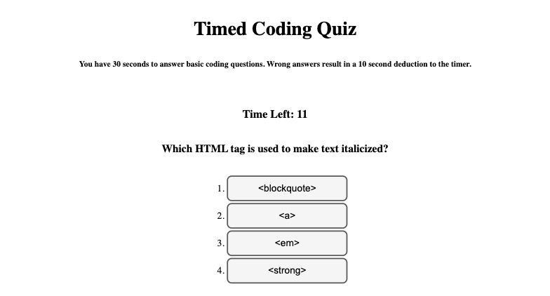

# Timed Coding Quiz

## Description

This timed quiz can help test the user's understanding of basic javascript. 

This project presented several interesting challenges:

- Working with objects to populate different portions of the page with data
- Using event listeners to evaluate the user's response and effect the timer
- Utilizing local storage and using JavaScript to create new elements on the page with that data

This project really instilled in me the value of console logs. There were a lot of moving pieces and they didn't always end up how I expected them to so using console logs to figure out where things were going wrong was really helpful.

## Usage

Click "Start Game" to begin quiz. Select one of the answers to the question to move to the next question. Once all questions are answered or timer runs out, you can input your intitials to save your score.

## License

MIT License

Copyright (c) 2023 Kate Rogers

Permission is hereby granted, free of charge, to any person obtaining a copy
of this software and associated documentation files (the "Software"), to deal
in the Software without restriction, including without limitation the rights
to use, copy, modify, merge, publish, distribute, sublicense, and/or sell
copies of the Software, and to permit persons to whom the Software is
furnished to do so, subject to the following conditions:

The above copyright notice and this permission notice shall be included in all
copies or substantial portions of the Software.

THE SOFTWARE IS PROVIDED "AS IS", WITHOUT WARRANTY OF ANY KIND, EXPRESS OR
IMPLIED, INCLUDING BUT NOT LIMITED TO THE WARRANTIES OF MERCHANTABILITY,
FITNESS FOR A PARTICULAR PURPOSE AND NONINFRINGEMENT. IN NO EVENT SHALL THE
AUTHORS OR COPYRIGHT HOLDERS BE LIABLE FOR ANY CLAIM, DAMAGES OR OTHER
LIABILITY, WHETHER IN AN ACTION OF CONTRACT, TORT OR OTHERWISE, ARISING FROM,
OUT OF OR IN CONNECTION WITH THE SOFTWARE OR THE USE OR OTHER DEALINGS IN THE
SOFTWARE.
